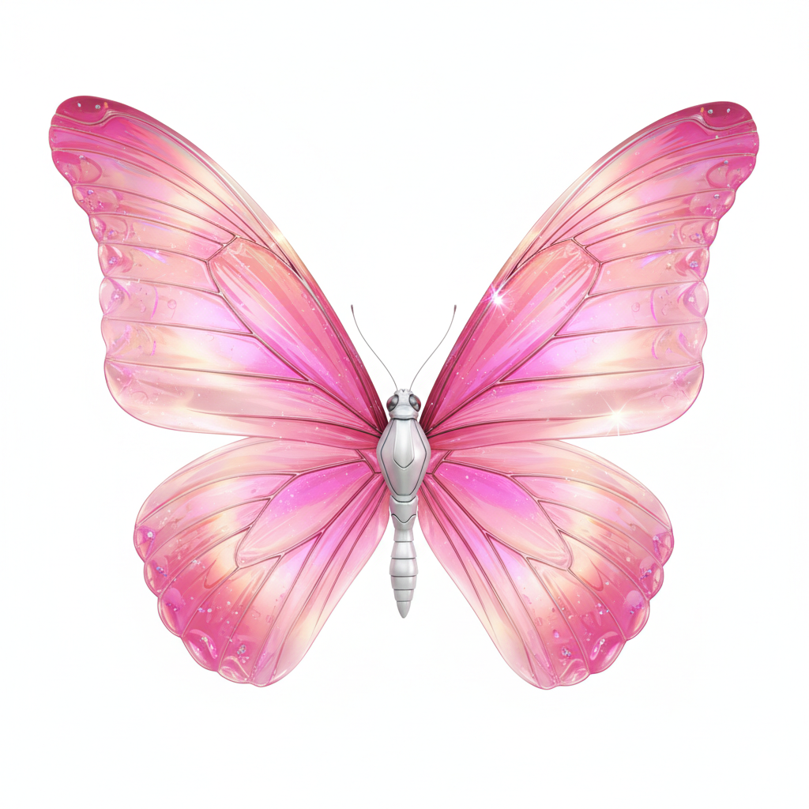
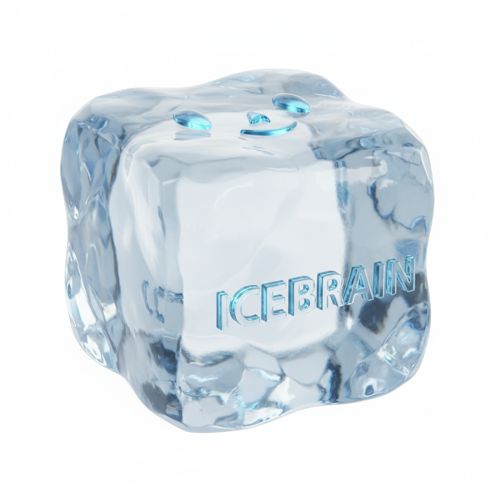
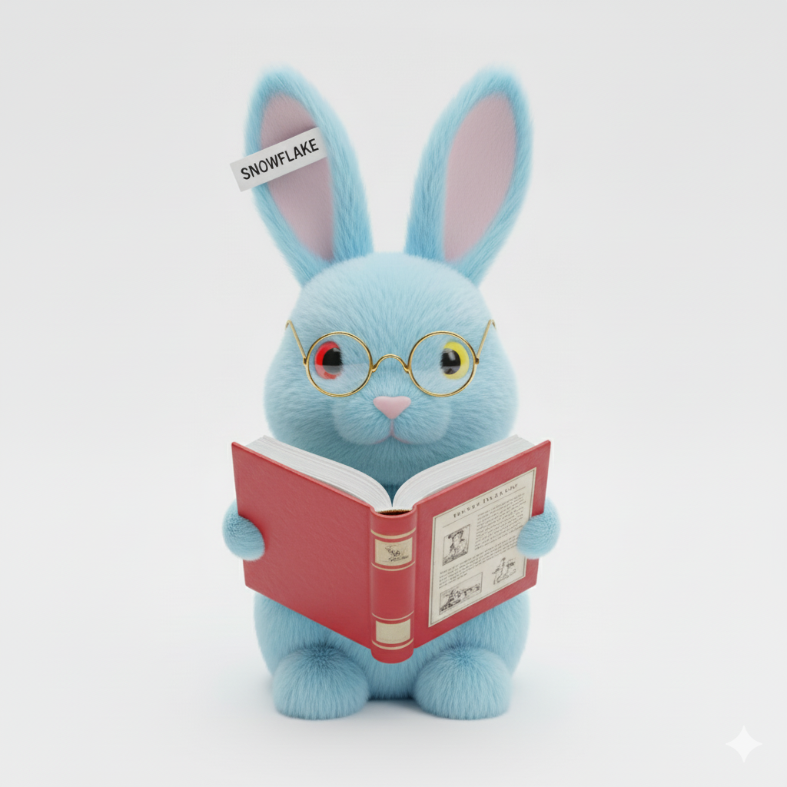
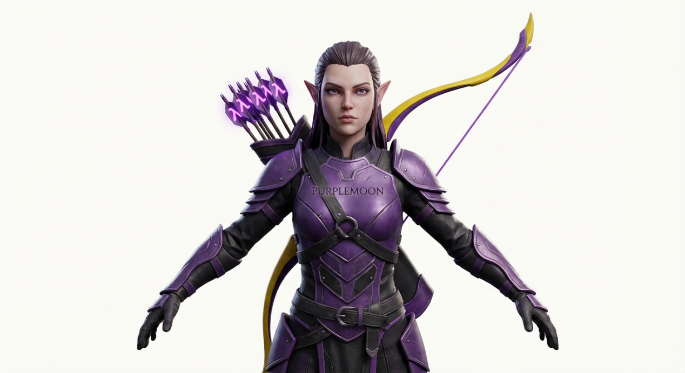

# 莱芙宁骑士团 部分研究员资料

## LFN0001-00100001

代号："盘古"

性别：男性

所属队：LFN0001 队（"开天骑兵"）

所属据点：LFN0001-001 据点（位于北京市朝阳区）

籍贯：北京市通州区

出生年份：2012 年

加入 GSCU 时间：2040 年

代表色：黄色、深红色

主要经历：

2040 年成立 LFN，并参与了 GSCU 的组建。（详见全球亚文化俱乐部联盟"联盟的发展"第零部分和第一部分）

个人吉祥物：

开天大侠（2040.4 - ）：穿黄色盔甲，身披深红斗篷，右手持巨锤的战神。锤头为钨制，手柄为铜制。


## LFN0001-00100003

代号："贞德"

性别：女性

所属队：LFN0001 队（"开天骑兵"）

所属据点：LFN0001-001 据点（位于北京市朝阳区）

籍贯：江苏省南京市江宁区

出生年份：2016 年

加入 GSCU 时间：2040 年

代表色：黄色、玫红色

主要经历：

毕业于上海美术学院，曾在毕业后不久入职南京某游戏公司，担任角色设计师。

2040 年与"盘古"等 LFN 研究员一同参与了 GSCU 的组建，并且为 LFN 设计了吉祥物。

个人吉祥物：

虹光蝶（2040.4 - ）：身体呈银白色，翅膀呈玫红色的巨型蝴蝶。



## LFN1335-00100001

代号："海燕"

性别：女性

所属队：LFN1335 队（"小燕子团"）

所属据点：LFN1335-001 据点（位于江苏省常州市武进区）

籍贯：江苏省常州市武进区

出生年份：2015 年

加入 GSCU 时间：2044 年

代表色：绿色、蓝色

主要经历：

2044 年加入 GSCU，成立了 LFN 第 1335 队（LFN1335）。

从 2044 年至 2060 年，作为 LFN 的知名写手之一，她撰写了十多部作品，以 AI 伦理为主要话题，在 LFN 内部甚至整个 GSCU 都引起了广大研究员的深刻思考，同时也促进了 GT、AL 等技术向俱乐部注重技术实现的伦理考量。

2055 年，为了促进知识共享，她代表 LFN 俱乐部，与 GT、AL、SLA 等俱乐部一起创建了"GSCU 研究员自学平台"（`https://selfstudy.gscuglobal.org`），该平台拥有大量的直播和录播课程，方便各位研究员利用空闲时间自学。

个人吉祥物：

1335 型人造精灵（2044.2 - ）：身穿蓝色制服，长着一对翠绿色翅膀的精灵。


## LFN1677-00500013

代号："晴"

性别：女性

所属队：LFN1677 队（"喵喵众"）

所属据点：LFN1677-005 据点（位于江苏省南京市江宁区）

籍贯：江苏省南京市江宁区

出生年份：2023 年

加入 GSCU 时间：2047 年

代表色：粉色、橙色

主要经历：

2045 年毕业于东南大学，2047 年加入 GSCU。

作为 LFN1677 内部的研究员，她曾代表 LFN1677，发起了一项重要的联盟决议：鼓励各俱乐部、队、据点搭建 Minecraft 服务器，为各位研究员提供发挥想象力的空间。

在该项决议通过后，她搭建了一个名为"LFN1677
Garden"的 Minecraft 服务器，许多 LFN1677 的研究员在闲暇之时都会来到这个服务器，他们通过建造，将平时不方便表达的想法在充满方块的世界中显现出来。就这样，LFN1677 的文化活力显著提高。

个人吉祥物：

第一代：粉晴（2047.8 - 2055.1）：体毛粉色与橙色相间，体态圆润，粉绿异瞳的猫。


第二代：糖糕（2055.1 - ）：体毛呈粉色，带有白色星点，蓝灰异瞳，外形大致呈长方体的猫。


## LFN2018-00100001

代号："冰火铁血"

性别：男性

所属队：LFN2018 队（"冰火剑骑士团"）

所属据点：LFN2018-001 据点（位于福建省厦门市海沧区）

籍贯：浙江省嘉兴市嘉善县

出生年份：2019 年

加入 GSCU 时间：2045 年

代表色：蓝色、橙色、钢灰色、灰褐色

主要经历：

2019 年出生于一个工匠家庭。

2045 年加入 GSCU 之初，他只是 LFN1335 一名普通的研究员，编号为 LFN1335-01400462（LFN1335-014 位于浙江省杭州市滨江区）。

在 2049 年 4 月 8 日，他为 LFN 创立了第 2018 队，名为"冰火剑骑士团"，编号 LFN2018。

之后，他退出了 LFN1335，成为 LFN2018 的"开队元帅"。

十多年来，他重视 LFN2018 内部各位研究员的意见，允许甚至鼓励 LFN2018 内部研究员当面指出 LFN2018 内部出现的问题，以及为 LFN2018 的发展提供建设性的、有远见的、可持续的建议，LFN2018 高速发展，从 2049 年的 300 多名研究员扩展到 2060 年的超过 100 万名研究员，将 LFN2018 打造成 LFN 内部的模范，甚至有数十个 LFN 队伍和一些非 LFN 队伍"取经"。

个人吉祥物：

圣火（2045.3 - ）：身穿熔岩战甲的忍者，手套周围有火焰轮廓。


## LFN2018-00121376

代号："白雪公主"

性别：女性

所属队：LFN2018 队（"冰火剑骑士团"）

所属据点：LFN2018-001 据点（位于福建省厦门市海沧区）

籍贯：浙江省嘉兴市桐乡市

出生年份：2029 年

加入 GSCU 时间：2052 年

代表色：蓝色、红色、白色

主要经历：

2052 年加入 GSCU，最初是 AL 的一名研究员，编号 AL0032-00102613（AL0032-001 位于浙江省嘉兴市桐乡市）。

在 2054 年，她从 AL 俱乐部转入 LFN 俱乐部。

2058 年，她与 AL 俱乐部合作，搭建了"GSCU Wiki"（`https://wiki.gscuglobal.org`），一个类似于维基百科，收录大量亚文化内容，并且带有 AI 讲解功能，方便内界（GSCU 研究员）和外界（非 GSCU 研究员）人士了解各种亚文化的 Wiki 网站。

个人吉祥物：

第一代：冰脑（2052.1 - 2054.2，AL 时期）：正方体冰块状的精灵，外表呈半透明蓝色，棱角光滑。



第二代：雪花（2054.2 - 2058.3，LFN 时期第一阶段）：浅蓝色的兔子，红黄异瞳。


第三代：雪花 2.0（2058.3 -，LFN 时期第二阶段------GSCU Wiki 时期）：浅蓝色的兔子，红黄异瞳，戴着金色眼镜，翻着一本厚厚的词典。



## LFN2018-00153182

代号："Color32"

性别：女性

所属队：LFN2018 队（"冰火剑骑士团"）

所属据点：LFN2018-001 据点（位于福建省厦门市海沧区）

籍贯：福建省厦门市海沧区

出生年份：2027 年

加入 GSCU 时间：2058 年

代表色：蓝色、绿色、红色、白色

主要经历：

"Color32"曾在 2049 年毕业于厦门大学信息学院人工智能系。

在 2058 年，"Color32"加入了 LFN2018-001。

作为一名建筑系"肝帝"，她在 Minecraft 中以复刻鼓浪屿、南普陀寺等厦门地标而闻名，其作品《方块鹭岛》系列是 LFN2018 内部最受欢迎的服务器景观之一。她正致力于将厦大的校园在 Minecraft 中 1:1 还原，并利用自己的 AI 专业知识，训练能够自主进行建筑细节填充的 NPC"工匠"。

个人吉祥物：

帕斯卡（2058.7 - ）：身穿蓝绿红白相间的工程师服装，手持建筑工具和代码编辑器，头戴安全头盔，象征建筑与编程的融合。


## LFN2018-00219471

代号："阿罗娜"

性别：女性

所属队：LFN2018 队（"冰火剑骑士团"）

所属据点：LFN2018-002 据点（位于浙江省嘉兴市秀洲区）

籍贯：浙江省嘉兴市秀洲区

出生年份：2038 年

加入 GSCU 时间：2057 年

代表色：天蓝色

主要经历：

出生于嘉兴的"阿罗娜"，是 GSCU"黄金时代"的原住民。

她对 LFN2018 的归属感源于血脉：她的父母都是 LFN2018-002 据点的早期成员。

她没有经历过父辈们在主流社会挣扎的"躺平"岁月，对她而言，GSCU 就是生活本身。

在 2058 年，她加入了 GSCU，成为了 LFN2018-002 的一名研究员。

她是一位充满活力的社区组织者，擅长策划大型线下田野活动，比如组织成员在秀洲的田埂上举办露天音乐节，或是在南湖的画舫上进行剧本杀。她认为亚文化不应只存在于数字空间，更应该与现实的土地和风土人情相结合。

个人吉祥物：

SINE（2057.9 - ）：天蓝色外壳的小电视，漂浮在空中，还有两个小音箱，分别在左右两侧。


## LFN2018-00900001

代号："硅砂匠人"

性别：男性

所属队：LFN2018 队（"冰火剑骑士团"）

所属据点：LFN2018-009 据点（位于福建省泉州市惠安县）

籍贯：福建省泉州市惠安县

出生年份：2023 年

加入 GSCU 时间：2051 年

代表色：黑色、蓝色、红色

主要经历：

"硅砂匠人"在 2051 年成立了 LFN2018-009 据点，并成为了该据点的管理员。

他是一位沉默寡言但技艺精湛的硬件极客。与 AL 俱乐部那些追逐最新 AI 模型的成员不同，他痴迷于"复古计算"。他的工作室里堆满了从旧货市场淘来的 8086 芯片和自己蚀刻的电路板。他坚信"理解旧技术是创造新技术的基础"。

在 2059 年，他通过汇编语言为一台修复好的 IBM PC/AT 编写了一个微型操作系统――GSCU FJMicro009（GPLv3 开源），并成功在该系统上运行了一个可以连接 GSCU Forum 的 BBS 客户端。他为联盟内的许多复古游戏爱好者提供硬件维修和定制服务，被誉为"能让硅基生命起死回生的人"。

个人吉祥物：无（他觉得，吉祥物这种东西太过花里胡哨）

## LFN2018-00907184

代号："光雨"

性别：女性

所属队：LFN2018 队（"冰火剑骑士团"）

所属据点：LFN2018-009 据点（位于福建省泉州市惠安县）

籍贯：山东省枣庄市台儿庄区

出生年份：2044 年

加入 GSCU 时间：2052 年

代表色：黑色、白色、黄色、深紫色

主要经历：

2052 年（8 岁）加入 GSCU。由于她年龄较小（截止至 2060 年，她还只有 16 岁，并且还是一名高一学生。这导致她在个别行动上会受到一定限制），大多数时间都在线上行动，线下行动通常只会在周末、节假日和寒暑假进行。

最初，她是 LFN2018-009（位于福建省泉州市惠安县）的一名研究员，编号为 LFN2018-00900372。

在加入 GSCU 之初，她就已经表现出编程天赋，能用 Scratch 写出简单的游戏。

10 岁（2054 年）时又接触了 C/C++和 Python，到了 12 岁，她开始负责一些简单的运维项目，到了 13 岁（2057 年），她又开始看《Learn You a Haskell for Great Good!》（LYAH）等 Haskell 书籍，短短几个月就已经掌握 Haskell 并能够通过 Haskell 参与开发。

截至 2060 年 4 月 1 日，她已参与过 LFN 的 40 多个软件开发项目，其中由她主导的超过 10 个，使用 Haskell 的有 3 个（均由她本人主导）。

2059 年 1 月 16 日（15 岁，戊寅年腊月初三），她返回老家山东省枣庄市台儿庄区，为 LFN2018 成立了一个新据点，据点编号为 LFN2018-469（LFN 第 2018 队第 469 据点），她的研究员编号变更为 LFN2018-46900001，但在一个多月后，2059 年 2 月 23 日（己卯年正月十二），由于寒假即将结束，加上她在几个月后要参加中考（2059 年 6 月），她将自己在 LFN2018-469 的线下事务转交给 LFN2018-46900002（出生于 2031 年，已成年，但具体身份未知），她自己则从山东返回福建，回归 LFN2018-009。

之后，她的研究员编号再次变更――她被重新授予一个新的研究员编号 LFN2018-00907184（由于她成立 LFN2018-469 之前已经退出 LFN2018-009，在她重返 LFN2018-009 之后，旧编号 LFN2018-00900372 不会再恢复）。

中考结束后不久，2059 年 6 月下旬，她被"白雪公主"授予 GSCU Wiki 管理员身份（在她之前，整个 GSCU 获得该身份的只有几百位，而在 LFN 也只有十几位，到了 LFN2018 则只有 4 位。她是 LFN2018 第五位 GSCU Wiki 管理员。），主要负责代码评审。

2060 年 3 月，她在 GSCU 研究员自学平台发布了"LFN 程序设计启蒙"（包含两个子系列："LFN 程序设计启蒙·Scratch"、"LFN 程序设计启蒙·Python"）和"LFN 程序设计与软件开发课堂"（包含三个子系列："LFN 程序设计与软件开发课堂·Python"、"LFN 程序设计与软件开发课堂·C/C++"、"LFN 程序设计与软件开发课堂·Haskell"）两个课程系列，但由于她还未成年，她的所有课程都是录播。

个人吉祥物：

2052.3 - 2054.6：无吉祥物。

第一代：光年（2054.6 - 2057.12）：戴着小黄帽，体毛呈白色，蓝黑异瞳的小鸭子。


第二代：紫月（2057.12 - ）：身穿紫黑相间战甲，背着一把黄色弓臂、紫色弓弦长弓，装有一种特殊弓箭（箭头形状是希腊字母 Lambda 的模样）的精灵。



## LFN2018-03700192

代号："蓝琴"

性别：女性

所属队：LFN2018 队（"冰火剑骑士团"）

所属据点：LFN2018-037 据点（位于山东省烟台市福山区）

籍贯：浙江省嘉兴市海宁市

出生年份：2033 年

加入 GSCU 时间：2054 年

代表色：深蓝色

主要经历：

"蓝琴"的父亲是一位远洋货轮的船长，她的童年在海宁的钱塘江畔听着潮声长大。

2054 年，她从嘉兴迁往烟台，加入了 LFN2018-037 据点。她将自己对海洋的热爱与亚文化完美结合：在 Minecraft 里，她是一位传奇的"船长"，以建造历史上各种著名的帆船和战舰而闻名；在现实中，她利用 Python 编写脚本，抓取和分析全球洋流与气象数据，为 GSCU 内部一些需要进行跨国物流的实体项目提供最优航线规划。

个人吉祥物：

蓝萌（2054.8 - ）：一只可爱的深蓝色水晶海豚。


## LFN2018-07100008

代号："蜀道椒云"

性别：女性

所属队：LFN2018 队（"冰火剑骑士团"）

所属据点：LFN2018-071 据点（位于四川省绵阳市游仙区）

籍贯：四川省绵阳市游仙区

出生年份：2029 年

加入 GSCU 时间：2055 年

代表色：红色

主要经历：

"蜀道椒云"是 LFN2018-071 据点的核心成员。她是一位美食亚文化爱好者和视频博主，在 2055 年加入了 GSCU。其在 GSCU 自学平台上开设的《赛博川菜》系列课程广受欢迎。

她不仅会复刻传统的川菜，更热衷于将动漫、游戏中的虚构食物用川菜的方式"魔改"出来，比如"麻辣味的小当家黄金炒饭"、"藤椒风味的火焰史莱姆凝胶"等。她坚信，味觉是连接不同亚文化最直接的桥梁。

个人吉祥物：无（吉祥物能吃吗？）

## LFN2018-10600788

代号："滇池月"

性别：女性

所属队：LFN2018 队（"冰火剑骑士团"）

所属据点：LFN2018-106 据点（位于云南省昆明市呈贡区）

籍贯：浙江省嘉兴市南湖区

出生年份：2035 年

加入 GSCU 时间：2057 年

代表色：无（她认为任何一种颜色都代表不了她的研究成果）

主要经历：

"滇池月"是 LFN2018 内部人才流动的典型代表。

她出生于嘉兴这个 GSCU/LFN2018 的"龙兴之地"，却在考上云南大学后钻研少数民族文化研究，并在 2057 年毕业后，选择加入了昆明的 LFN2018-106 据点。作为一名曾主修民族学的云南大学毕业生，她对西南地区的少数民族神话和服饰文化有着浓厚兴趣。

她正致力于一个庞大的个人项目——"GSCU 民族之光"，计划将云南 25 个少数民族的传统服饰和神话故事，系统性地整理并上传到 GSCU Wiki，同时为这些服饰制作精美的 Minecraft 皮肤和虚拟形象模型。她希望将这些被主流视野忽视的宝贵文化，通过 GSCU 的平台永久保存下来。

个人吉祥物：无（她认为自己的研究成果就是最好的吉祥物）

## LFN2018-22600001

代号："杜布阿苏"

性别：女性

所属队：LFN2018 队（"冰火剑骑士团"）

所属据点：LFN2018-226 据点（位于广东省江门市台山市）

籍贯：广东省江门市台山市

出生年份：2035 年

加入 GSCU 时间：2051 年

代表色：银白色、蓝色、金色

主要经历：

2039 年，4 岁的她随父母从江门台山搬到广州，从素描开始自学绘画。（她的家庭收入一般，报不起培训班。她是靠父母从市场上淘来的 1990 年代到 2020 年代的旧书学习的）

2051 年，年仅 16 岁的"杜布阿苏"加入了 SLA0013，成为了 SLA0013-00508355。

刚成为研究员时，她只有一台 RAM 4GB，存储空间 128GB 的 ARMv8 平板（操作系统是 Lubuntu（注意，不是 Ubuntu，是相比 Ubuntu 更为轻量的 Lubuntu），由某位身在深圳的 GT 研究员手工制作，价格是 29 GSD，按 2051 年 1 GSD = 1.29 USD 的汇率，大概是 37.41 USD，折合人民币约 260 元），她只用一款名为"Lovelavinci"（这个名称由"Ada Lovelace"和"Da Vinci"这两位历史上的重要人物的姓氏组成）的绘画软件，由某位身在法国的 AL 研究员使用 Haskell（核心）、Ruby（UI 界面）、Lua（大量的画笔脚本）从 2049 年开始开发并以 GPLv3 开源，大小仅 70MB。她通过这款软件为 SLA 各位研究员出品的小说制作了许多精美的插画，这些插画每天能为她带来 12 至 45 GSD 的收入，虽然不多，但维持她自己每天的生活还是可以的。

2056 年 12 月 27 日，"杜布阿苏"计划离开 SLA0013，成立一个新据点。她向 LFN2018 的队长"冰火铁血"寻求经济支持与技术支持。

12 月 28 日，"杜布阿苏"返回故乡台山，为新据点的成立做最后准备。

2057 年 1 月 1 日，"杜布阿苏"宣布 LFN2018-226 据点正式成立，她成立这个据点，为的是培养绘画高手。

虽然在 2060 年，LFN2018-226 仅有一千多名研究员，但 25 岁的她，在这三年里成功建立了一个在整个联盟数一数二的插图制作团队。

个人吉祥物：

闪闪（2051.6 - ）：银白色的甜甜圈精灵，带有金属光泽。


## LFN2312-00100023

代号："优兔酱"

性别：女性

所属队：LFN2312 队（"仓鼠森友会"）

所属据点：LFN2312-001 据点（位于浙江省嘉兴市秀洲区）

籍贯：浙江省嘉兴市秀洲区

出生年份：2040 年

加入 GSCU 时间：2048 年

代表色：天蓝色

主要经历：

"优兔酱"是在"仓鼠事变"后临危受命，接任 LFN2312 队长职务的关键人物。

她出生于 GSCU 成立的同一年，是联盟精神的同龄人。

在 2048 年，她加入了 LFN1677（喵喵众），成为了 LFN1677-008 的一名成员（当时她的编号是 LFN1677-00800044），在那里积累了丰富的社区管理经验，以稳重、细心和极强的亲和力著称。

2050 年，受到"仓鼠派蒙"邀请，她加入了 LFN2312（当时名叫"仓鼠大公国"），并在之后几年为 LFN2312 的建设作出了极大的贡献。

然而，在"仓鼠派蒙"试图将队伍商业化时，她是内部最坚定的反对者之一。

她认为，LFN2312 的灵魂在于成员之间像"森友会"一般的温暖羁绊，而非冷冰冰的商业价值。

上任后，她致力于修复队内裂痕，重建信任，并加强与 LFN1677、LFN2018 等兄弟队伍的联系，带领"仓鼠森友会"重新走上了正轨。

个人吉祥物：无（她觉得自己不需要吉祥物这种东西）

## LFN2312-00100625

代号："雷霆符文"

性别：男性

所属队：LFN2312 队（"仓鼠森友会"）

所属据点：LFN2312-001 据点（位于浙江省嘉兴市秀洲区）

籍贯：陕西省安康市紫阳县

出生年份：2034 年

加入 GSCU 时间：2054 年

代表色：紫色、黄色

主要经历：

"雷霆符文"是从秦岭深处走出来的编程天才。

他痴迷于《原神》中雷电将军的"无想的一刀"，追求代码的极致简洁与"真理"。为此，他在 2054 年加入了 GSCU，成为了 LFN2312 的一名研究员。

他也是一位罕见的"全栈"程序员，能用 Java 和 C/C++为 Minecraft 编写复杂的服务器插件，也能用 Haskell 为 GSCU 的后台系统贡献优雅的函数式代码。

他的 Minecraft 皮肤正是一个穿着印有 Lambda 符号（λ）T 恤的少年，象征着他对 Lambda Calculus（函数式编程的理论基础）的信仰。

在"仓鼠事变"中，他利用自己的技术能力，第一时间搭建了内部匿名投票和信息发布系统，确保了反对商业化的声音能够被清晰地传达，是"优兔酱"能够顺利接管队伍的重要技术支持者。

吉祥物：

Lambda Smith（2054.3 - ）：他直接用 Minecraft 皮肤作为自己的吉祥物。


## LFN2312-00201025

代号："草莓旋风"

性别：女性

所属队：LFN2312 队（"仓鼠森友会"）

所属据点：LFN2312-002 据点（位于浙江省嘉兴市秀洲区）

籍贯：福建省厦门市思明区

出生年份：2040 年

加入 GSCU 时间：2056 年

代表色：红色

主要经历：

"草莓旋风"是一位狂热的《明日方舟》"博士"，以其出神入化的游戏攻略和世界观深度解析而在 LFN2312 内部闻名。

在 2056 年，她选择从厦门搬到嘉兴，为的是更深入地参与 LFN2312 的社区生活。

她不仅游戏玩得好，更是一位优秀的同人画师，其创作的"罗德岛下午茶"系列插画在 GSCU Forum 上广受好评。

个人吉祥物：

草莓 VVI（2056.12 - ）：这是她设计的一位自定义 6 星干员（虽然无法实装到《明日方舟》），详见"草莓 VVI"条目。


## LFN2312-00201385

代号："Blue Laser"

性别：男性

所属队：LFN2312 队（"仓鼠森友会"）

所属据点：LFN2312-002 据点（位于浙江省嘉兴市秀洲区）

籍贯：福建省泉州市安溪县

出生年份：2049 年

加入 GSCU 时间：2057 年

代表色：蓝色

主要经历：

"Blue Laser"是 LFN2312 的新星，在 2057 年，年仅 8 岁的他加入了 GSCU，是一位痴迷于化学与像素艺术的结合的天才少年。

他认为硫酸四氨合铜（$\mathrm{Cu(NH_3)_4SO_4}$）晶体那深邃的蓝色，是世界上最美的"像素块"。

在 Minecraft 中，他建造了一座巨大的、模拟晶体生长过程的自动化建筑群；在现实中，他则用 Python 编写程序来模拟分子结构和化学反应。

个人吉祥物：

铜氨晶灵（2057.5 - ）：一只蓝色结晶体小怪物，上面写着化学式"$\mathrm{Cu(NH_3)_4SO_4}$"。


## LFN2312-00201582

代号："呼伦雪"

性别：女性

所属队：LFN2312 队（"仓鼠森友会"）

所属据点：LFN2312-002 据点（位于浙江省嘉兴市秀洲区）

籍贯：内蒙古自治区呼伦贝尔市额尔古纳市

出生年份：2047 年

加入 GSCU 时间：2059 年

代表色：绿色、银色、白色

主要经历：

在 2059 年，"呼伦雪"从一望无际的草原搬到了小桥流水的江南。这种巨大的环境反差塑造了她独特的艺术风格。

她是一位年轻的音乐人，擅长将马头琴、呼麦等蒙古族传统音乐元素与电子音乐融合，创作出的"赛博长调"风格在 BON 俱乐部都引起了不小的关注。

她之所以选择 LFN2312，是因为她觉得"仓鼠森友会"这个名字让她想起了草原上那些可爱的小动物，有一种家的感觉。

然而，当"仓鼠派蒙"准备让 LFN2312 脱离 GSCU 的时候，她与 LFN2018-00900001"硅砂匠人"合作，创作了一首名为"2312 冲击波"的歌曲，这首歌以 21 世纪初的"冲击波"病毒（该病毒能导致 Windows XP 等操作系统频繁重启，此外还能造成许多严重破坏）为灵感，据称，"硅砂匠人"为歌曲设计了如下唱片封面：

```plaintext
即将失去研究员资格

❌ 研究员资格即将撤销。请放弃正在执行的计划，然后回去睡觉。未放弃的计划将会失败。撤销是由 GSCU\治理委员会 初始的

离撤销还有： 00:00:20

消息：

仓鼠派蒙，我劝你赶快放弃这个想法。我们待在GSCU不是还好好的吗？


```

该封面参考了这个经典的弹窗：

```plaintext
系统关机

❌ 系统即将关机。请保存所有正在运行的工作，然后注销。未保存的改动将会丢失。关机是由 NT AUTHORITY\SYSTEM 初始的

离关机还有： 00:00:20

消息：


```

个人吉祥物：无（她还没有想好）
