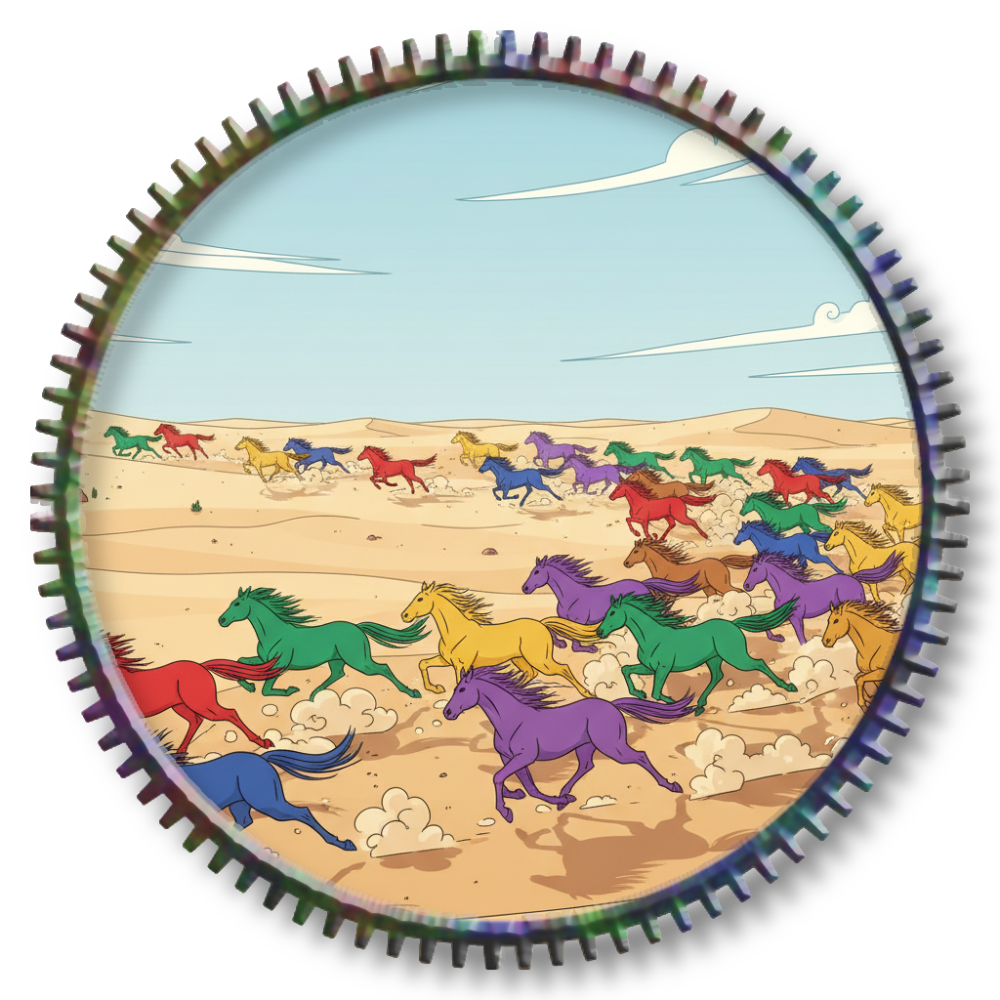
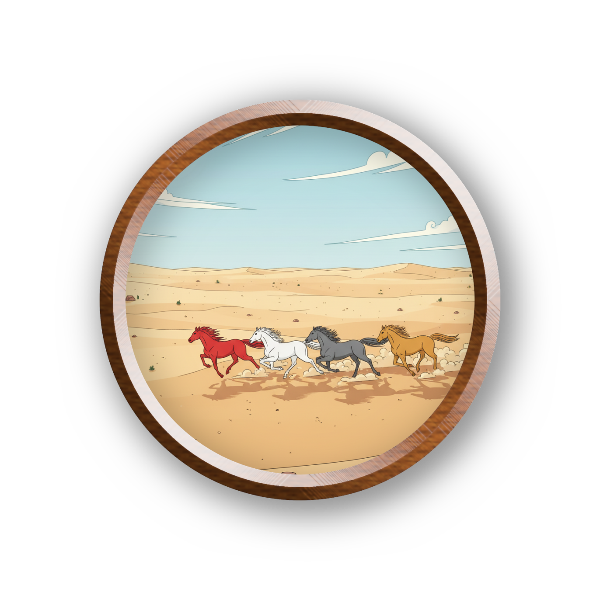

# 莱芙宁骑士团

莱芙宁骑士团（英文：The Knights of Lifrning。"Lifrning"是一个自造词，取自"Life"的前三个字母"Lif"和"Learning"的后五个字母"rning"，组合成"Lifrning"），全球亚文化俱乐部联盟（GSCU）俱乐部代号 LFN，是 GSCU 的一个大型俱乐部、九大创始俱乐部之一。2040 年成立于北京市朝阳区，并在 2040 年 4 月 8 日同其余八个俱乐部一起创立了 GSCU。

## 俱乐部概况

LFN 是 GSCU 规模最大的俱乐部，因其亚文化大杂烩的特点闻名。LFN 吸引了众多亚文化爱好者，各种亚文化并存与融合，被认为是联盟"包罗万象"的象征。

截至 UTC 2060 年 4 月 8 日零点，LFN 一共有 7236 队，89132 据点，14237816 名研究员（≈1423.78 万）；全俱乐部总共有 21302 名俱乐部秘书和 9544 名副部长（其中，副部长领班 416 名，而这些领班当中又有 16 名大领班）。

## 俱乐部标志

俱乐部徽章：

LFN 的俱乐部徽章名为"大漠长驱"。

大漠长驱大致呈圆形，分为两种版本：

直径大于等于 60 厘米的是齿轮版本，内孔直径为齿顶直径的十分之九，边缘共有 88 个齿（齿的高度为齿顶直径的四十分之一），象征夜空中的 88 个星座，内部背景为漫无边际的沙漠，沙漠上有许多匹各种颜色的、奔腾不息的马，象征 LFN 的包容万象和无懈可击。

直径小于 60 厘米的是圆盘版本，内直径为外直径的八分之七，边缘没有齿，内部背景仍然是漫无边际的沙漠，沙漠上有四匹马：深红、白、钢灰、米黄，呼应 LFN 俱乐部旗帜上的四种颜色。

俱乐部旗帜：

LFN 的俱乐部旗帜名为"四方神圣"，长宽比为一比一，用对角线切成四个等腰直角三角形，分别代表东、南、西、北四个方位。

东方的三角形为深红色（C0 M100 Y100 K60），象征 LFN 如东方红日般活力十足。

南方的三角形为白色（C0 M0 Y0 K0），象征 LFN 如冰雪般圣洁。

西方的三角形为钢灰色（C25 M0 Y0 K50），象征 LFN 如钢铁般坚不可摧。

北方的三角形为米黄色（C0 M0 Y65 K0），象征 LFN 如沙漠中的骆驼般永不放弃任何能够生存下去的希望。

俱乐部代表色：米黄色、深红色、钢灰色

俱乐部吉祥物：

LFN 俱乐部的吉祥物名为"莱芙宁・哈莫尼"（英语：Lifrning Harmonie），一名长着金、黑、白三色渐变长发，身穿玫红色披风，骑着一只阿哈尔捷金马的女骑士。

金、黑、白渐变，象征 LFN 将多种亚文化兼收并蓄；玫红色披风象征 LFN 坚不可摧；阿哈尔捷金马则象征 LFN 潜力无穷。

俱乐部口号：多元共存，兼收并蓄！（Diverse coexistence and inclusive!）

俱乐部歌曲：

《万物共存》

词：LFN0001-00100013

曲：LFN0003-00200005

\[Intro\]

我们是 LFN，包容万象的俱乐部！

我们是 LFN，兼收并蓄的俱乐部！

多元共存，包容万象！

多元共存，兼收并蓄！

\[Verse 1\]

盘古开天辟地，造就大千世界。

世间万物点缀天地。

多元人类，造就多元文化。

兼收并蓄乃我使命！

\[Verse 2\]

四方神圣之旗，带领我们走向光明。

大漠长驱之章，指导我们前进再前进！

\[Verse 3\]

LFN，莱芙宁骑士团。

兼收并蓄乃我使命！

LFN，莱芙宁骑士团。

兼收并蓄乃我使命！

（英语版本）：

\"Coexistence of All Things\"

Lyrics: LFN0001-00100013

Music: LFN0003-00200005

\[Intro\]

We are LFN, an all-encompassing club!

We are LFN, an inclusive club!

Diverse coexistence, embracing all things!

Diverse coexistence and inclusive!

\[Verse 1\]

Pangu separated heaven and earth, creating the vast world.

All things in the world adorn heaven and earth.

Diverse humanity creates diverse cultures.

Inclusivity is my mission!

\[Verse 2\]

The flag of the \"Four Sacred Ones\" leads us towards the light.

The emblem of \"The Long March in the Desert\" guides us forward!

\[Verse 3\]

LFN, The Knights of Lifrning.

Inclusivity is my mission!

LFN, The Knights of Lifrning.

Inclusivity is my mission!
