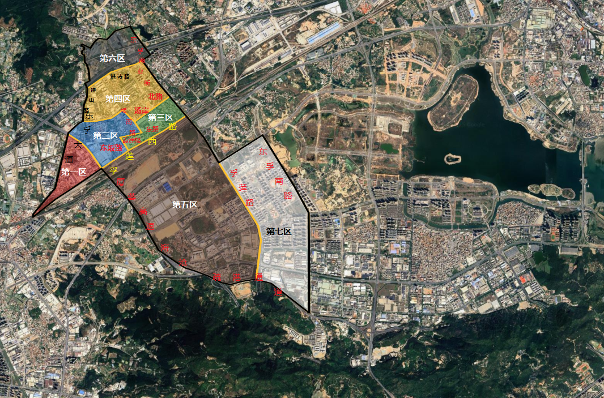
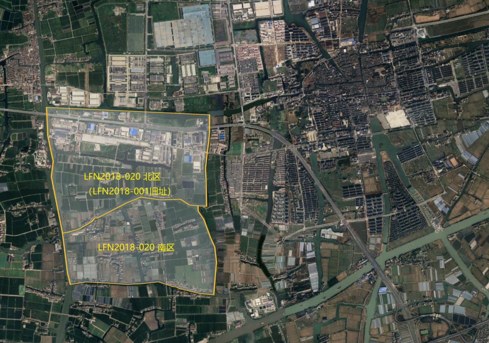

# LFN2018-001

LFN2018-001 是莱芙宁骑士团第 2018 队"冰火剑骑士团"（LFN2018）的第一个据点，全球亚文化俱乐部联盟（GSCU）内部编号 LFN2018-001，2049 年 4 月 8 日成立于浙江省嘉兴市嘉善县，2054 年 2 月 4 日迁往福建省厦门市海沧区东孚街道。

## 据点概况

截止至 2060 年 4 月 8 日，LFN2018-001 拥有 60,132 名研究员，是 GSCU 规模最大的据点。LFN2018-001 分为七个区：

第一区（2054 年 2 月设立）：由东孚大道、孚莲西路、厦蓉高速（G76）围成，东北（厦蓉高速）与第二区毗邻，面积约 850,330 平方米。

第二区（2054 年 2 月设立），2054 年 2 月设立：由东孚大道、坂南路、霞涂楼东路、东坂路、孚莲西路围成，北侧（东孚大道）、东北（坂南路）与第四区毗邻，东南（坂南路、霞涂楼东路、东坂路）与第三区毗邻，西南（厦蓉高速）与第一区毗邻，南侧（孚莲西路）与第五区毗邻，面积约 1,066,240 平方米。

第三区（2054 年 2 月设立）：由汤岸北路、孚莲路、孚莲西路、东坂路、霞涂楼东路围成，东北（孚莲路）与日月谷温泉毗邻，东南（孚莲西路）与第五区毗邻，西侧（坂南路、霞涂楼东路、东坂路）与第二区毗邻，西北（汤岸北路）与第四区毗邻，面积约 688,220 平方米。

第四区（2056 年 8 月设立）：由诗山路、寨后北路、洪诗路、东孚商业街、孚莲路、汤岸北路、坂南路、东孚大道围成，东南（孚莲路）与日月谷温泉毗邻，东北（东孚商业街）与东孚街道办事处毗邻，北侧（洪诗路）与第六区毗邻，西南（坂南路）与第二区毗邻，东南（汤岸北路）与第三区毗邻，面积约 1,693,080 平方米。

第五区（2057 年 6 月设立）：由孚莲路、海沧疏港通道、厦蓉高速、孚莲西路围成，北部有鹰厦铁路、杭深铁路、龙厦铁路共三条铁路穿过，西北（孚莲西路）与第二区毗邻，东北（孚莲西路）与第三区毗邻，东侧（孚莲路）与第七区毗邻，面积约 7,561,570 平方米。

第六区（2058 年 1 月设立）：由洪诗路、杨厝路，以及两条无名道路（该区北侧和西侧）围成，东南（洪诗路）与东孚街道办事处毗邻，西北（西侧无名道路）与厦门烟草工业有限责任公司（东孚街道）毗邻，北侧（北侧无名道路）、西侧（西侧无名道路）与天竺山森林公园毗邻，面积约 1,094,870 平方米。

第七区（2059 年 8 月设立）：由东孚南路、海沧疏港通道、孚莲路、孚莲东二路围成，西侧（孚莲路）与第五区毗邻，面积约 4,092,440 平方米。

总占地面积约 17,046,750 平方米（约 17.05 平方公里或 2.557 万亩），相当于大连星海广场（1.76 平方公里）的约 9.7 倍，吉林大学（7.3458 平方公里）的约 2.3 倍，澳门特别行政区（33.3 平方公里）的大约二分之一，是 GSCU 面积最大的据点。

核心区域（第一区）与海沧区政府（位于厦门市海沧区嵩屿街道）的直线距离约为 14 公里，与厦门市政府（位于厦门市思明区湖滨北路）的直线距离约为 19 公里。

## 据点历史

2049 年 4 月 8 日，LFN2018-001 在浙江省嘉兴市嘉善县西塘镇成立。最初的 LFN2018-001，距离西塘古镇景区大约 3 公里，据点面积约 2,522,070 平方米。

2054 年 2 月 4 日，冰火铁血将 LFN2018-001 从浙江省嘉兴市嘉善县西塘镇迁移到福建省厦门市海沧区东孚街道。LFN2018-001 的旧址被转让给 LFN2018-020，成为 LFN2018-020 北区（LFN2018-020 据点原有区域（面积约 1,829,670 平方米）则成为 LFN2018-020 南区）。LFN2018-001 新址最初面积约 2,604,790 平方米，分三个区。

2056 年 8 月，LFN2018-001 第一次扩建，设立第四区。

2057 年 6 月，为支撑一年后将要启用的"GSCU Wiki"的运营，LFN2018-001 进行了第二次扩建，设立第五区，采购 4U 服务器数千台，并在第五区北侧（靠近孚莲西路）建造了多个机房。

2058 年 1 月，LFN2018-001 第三次扩建，设立第六区。

2059 年 8 月，LFN2018-001 第四次扩建，设立第七区，在尽可能消除商业化与消费主义影响的前提下，并主动在第五区、第七区引进两百多家门店（涉及蜜雪冰城、华莱士、沙县小吃等品牌）及各式地摊。

## 分区详情

第一区："赤炎铸铁" (Crimson Forged-Iron)

作为 2054 年迁入时最早建立的区域之一，这里是 LFN2018-001 的行政和精神中心。建筑风格融合了现代科技感与工匠精神，可以看到裸露的金属结构和巨大的玻璃幕墙。

地标：

铁砧广场: 据点的中心广场，中央矗立着一座由退役服务器机箱熔铸而成的巨型"铁砧"雕塑（高度约 55 米），象征着冰火铁血的理念。是举办大型集会和纪念活动的地方。

001 号塔楼: 据点最高建筑，高度约 148 米，是队长办公室、各级管理层会议室和据点主数据中心所在地。塔顶的信号灯以"冰蓝色"和"火焰橙"交替闪烁。

历史档案馆: 收藏着 LFN2018 从创立至今的所有重要文档、照片、创作作品和成员名录。

第二区："凛冬铁剑" (Winter\'s Iron Sword)

该区域是据点人口密度最高的居住区之一，由模块化的公寓楼、共享工作室和公共活动空间组成。街道上空布满了全息投影广告牌（播放的是据点内部的活动通知和优秀作品展示，而非商业广告）。

特色：

创客工坊 (Maker\'s Forge): 提供从 3D 打印、激光切割到高级机械臂的各种工具，供本据点及 GSCU 各据点研究员们将数字创作实体化。TR 俱乐部的成员经常来这里进行技术交流。

24 小时协作空间: 分布在各处的公共空间，提供高速网络和算力终端，随处可见正在进行头脑风暴或线上协作的小组。

第三区："天籁青铜" (Celestial Bronze)

该区域以娱乐和公共文化生活为主，是据点的"交响乐大厅"。

特色：

"回响" Livehouse: BON 俱乐部成员经常光顾的地下音乐演出场所，以其顶级的音响设备和自由的氛围闻名。

"陨冰"电竞馆与"后羿"VR 体验中心: RPG 俱乐部成员的聚集地，拥有联盟内最先进的沉浸式设备，定期举办各类游戏竞赛。

"圣歌"大型图书馆: 收藏有海量的实体书籍、漫画、设定集和游戏光盘。

第四区："静谧白银" (Tranquil Silver)

这里是据点的"思考者"与"疗愈者"的家园。相比第二区的热闹，这里的建筑密度更低，拥有更多的绿化和开放空间，与远处天竺山的林风融为一体。

特色：

"冥想之庭": 一片融合了东方禅意与赛博朋克风格的园林，为研究员提供一个断开网络、放松精神的物理空间。

"心巢"心理健康中心: 由拥有专业资质的研究员提供免费的心理咨询、互助小组和压力管理工作坊。这是 GSCU 内部最大、最完善的心理支持设施之一，体现了骑士团对成员福祉的人文关怀。

宠物寄养与互动区"毛茸茸大使馆": 设有专业的宠物寄养中心和宽敞的户外活动区，是据点里最治愈的角落之一。

第五区："月光硅钢" (Moonlight Silicon-Steel)

面积最大，也是据点技术"心脏"所在地。巨大的服务器机房群发出低沉的嗡嗡声，与另一侧商业街的喧嚣形成对比。

设施：

GSCU Wiki 数据中心"亚历山大": 一座巨大的、拥有独立制冷系统的建筑群，是整个 Wiki 项目的心脏。由"白雪公主"及其团队负责运维。其算力也为第六区的 AI 课程和第四区的心理健康数据分析提供支持。

"不夜街"二号: 作为生活区的补充，引入了蜜雪冰城、沙县小吃等平价品牌。所有商户必须接受 GSD 支付，并自愿将其非涉密的运营数据接入据点内网，以防止恶性商业竞争和消费主义陷阱，并用于后勤系统的 AI 优化调度。

第六区："晨曦秘银" (Mithril of Dawn)

该区域靠近天竺山森林公园，环境更为宁静，是据点的"后花园"和"学院区"。

设施：

GSCU 自学平台 LFN2018-001 线下中心: 设有多个多媒体教室和录播室，不仅供本据点成员录制课程，其强大的后期制作能力也服务于整个联盟。

"启示者"档案馆分馆: 与第一区的历史档案馆不同，这里专门收藏和研究已经消亡或濒危的亚文化资料。是 GSCU 的"文化方舟"，也是许多创作者寻找灵感的圣地。

第七区："脉动玄铁" (Pulsing Black Iron)

据点的"大动脉"，承载着核心商业、生活服务与对外物流功能。

设施：

"不夜街"一号: 据点最繁华的商业核心区，比"不夜街"二号规模更大，品类更全。这里是据点烟火气最浓的地方。

物流中心: 负责处理据点内外庞大的物资流转，包括从 GT 俱乐部采购的服务器硬件、成员创作的实体作品（如模型、同人志）的对外寄送。其高效的自动化分拣系统本身就是一件由 GT 和 LFN2018 成员合作开发的杰出作品。

## 据点管理与日常生活

治理结构："LFN2018-001 据点管理委员会"由各区代表和职能部门负责人（如技术运维部、社区活动部、后勤保障部）组成。重大决策通过内部论坛投票决定。

新成员引导：新加入的研究员会先在第一区的"迎新营"进行为期一周的引导，了解据点历史、文化和各项设施。

内部经济：除了 GSD，据点内部可能还有一种"贡献点"系统。研究员通过参与公共服务（如服务器维护、组织活动、打扫公共区域）获得贡献点，可以用来兑换稀有资源（如高端服务器算力使用时间、创客工坊的稀有材料等）。

交通系统：在 17 平方公里的据点内，有无人驾驶的电动穿梭巴士和共享单车系统（由 LFN、GT、TR 三方共同研发），连接各个区域。

"不夜街"（包括一号核心区和二号生活区）是 LFN2018-001 据点为了满足数万名常驻研究员日常生活需求而设立的商业服务区。然而，它的运营从一开始就遵循着一套由冰火铁血亲自参与制定的、旨在对抗消费主义的严苛准则。这套准则被戏称为"铁砧协议"。

1. 准入与所有权限制------"租户"而非"业主"
无产权出售："不夜街"的所有商铺产权都归 LFN2018-001 据点集体所有，商户只拥有经营租赁权。这从根本上杜绝了资本通过炒作房地产来渗透据点的可能性。

严格的准入审核：想要入驻的品牌（即使是蜜雪冰城、沙县小吃这类平价品牌）必须通过据点管理委员会的审核。审核标准包括：

必需性原则：该服务是否为据点成员日常生活所必需？（餐饮、便利店、理发店优先）

非奢侈品原则：拒绝所有奢侈品、高端美妆、快时尚等以制造消费焦虑为主要盈利模式的品牌入驻。

价值观兼容原则：优先选择那些在外部世界有良好社区声誉、支持开源或对亚文化友好的品牌。
2. 广告与营销限制------"信息"而非"诱惑"
禁止外部商业广告："不夜街"区域内的所有公共显示屏（包括商户自己的屏幕）禁止播放任何以刺激消费为目的的商业广告。所有显示内容必须是信息性的，如菜单、产品成分、服务说明，或是据点内部的公共通知和成员作品展示。

禁止诱导性营销策略：禁止使用"限时抢购"、"饥饿营销"、"消费满减送"、"会员积分升级"等典型的消费主义营销手段。价格必须公开透明，鼓励的是按需购买，而非冲动消费。

包装极简化：据点鼓励并补贴采用极简包装的商户。华丽的、过度包装的商品在这里会受到社区成员的普遍鄙视。
3. 定价与利润限制------"服务费"而非"利润最大化"
透明的成本定价法：所有商户必须向据点管理委员会公开其成本结构（原材料、人工、租金、水电）。最终售价采用"成本+固定服务费率"的模式。这个服务费率（例如 15%）由管理委员会和商户代表共同协商确定，确保商户能获得合理利润以维持运营，但无法牟取暴利。

动态价格补贴：对于基础生活必需品（如主食、饮用水），据点会利用公共财政（来自联盟拨款或内部项目收益）进行补贴，确保其价格远低于外部市场，保障所有成员的基本生活质量。

利润上限与社区回馈：当商户的月度利润超过某个动态的阈值时，超出部分则需取其中一部分作为"社区发展基金"上缴给据点，用于维护公共设施或支持成员的非盈利创作项目。
4. 数据与技术监管------AI 驱动的"计划经济 2.0"
运营数据接入：如前所述，所有商户的销售、库存等非涉密运营数据必须接入据点的中央管理系统。

AI 辅助供需平衡：据点的 AI 系统（由 AL 俱乐部的技术专家协助开发）会分析这些数据，预测成员的需求，并向商户提供精准的备货建议。这极大地减少了因市场信息不透明而造成的浪费（比如食物过期）和短缺，实现了一种高效的、数据驱动的"计划供给"。

去中心化点评系统：据点内部有一个基于 GPC 身份的、完全匿名的点评系统。评价维度不是"好不好吃"，而是"是否健康"、"性价比"、"服务效率"、"是否浪费"等更务实的指标。差评过多的商户会被要求整改，甚至被取消租赁资格。

## 对外联系

物理边界：据点并非完全封闭的堡垒。主要出入口设有门禁，研究员可通过 IC 卡或 GPC 编号验证自由出入。访客需要提前申请或由内部成员带领。

与地方社区的互动：

技术合作：据点内的技术团队（尤其是受 AL 影响的部分）可能会与厦门本地的大学或科技公司有非商业性的技术交流项目。

文化输出：定期举办向公众开放的"开放日"活动，如亚文化展览、技术分享会、小型音乐节，向外界展示 GSCU 的文化，吸引新成员。

社会责任：据点可能会利用其技术资源，为厦门本地社区提供一些公益服务，如维护开源软件、提供免费编程教育等，以建立良好的公共关系。
