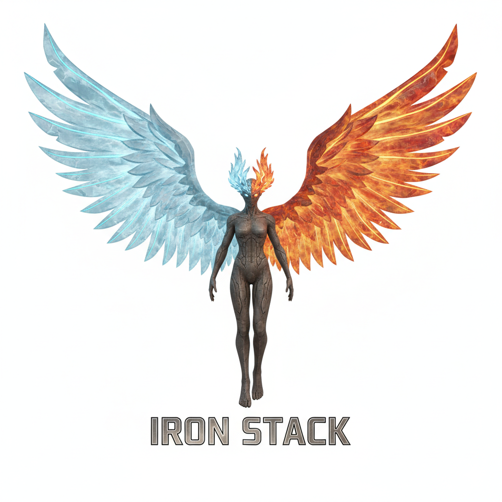

# 冰火剑骑士团

冰火剑骑士团（英文：the Knights of the Sword of Ice and Fire），全球亚文化俱乐部联盟（GSCU）内部编号 LFN2018，是 GSCU 的 LFN 俱乐部所属的第 2018 个队，2049 年成立于浙江省嘉兴市嘉善县。

## 概况

LFN2018 是 LFN 规模最大的队，2049 年 4 月 8 日由原 LFN1335 研究员"冰火铁血"创立。

截至 UTC 2060 年 4 月 8 日零点，LFN2018 一共有 645 个据点，1037512 名研究员（≈103.75 万），分布在中国及海外 26 个国家；全俱乐部总共有 21302 名俱乐部秘书和 3632 名副队长（其中，副队长领班 145 名，而这些领班当中又有 8 名大领班）。

LFN2018 在中国有 593 个据点，合计 906575 名研究员。大陆的 4 个直辖市、293 个地级市、30 个自治州、7 个地区、3 个盟以及 32 个省直辖县级行政区，香港、澳门 2 个特别行政区，台湾省的 6 个地级市、3 个县级市、11 个县都有据点分布。

而在海外 26 个国家，LFN2018 总共有 52 个据点，合计 130937 名研究员。据点数量最多的海外国家是芬兰，有 5 个据点。

## 队标志

队徽：

LFN2018 的队徽名为"铁血宝剑"，酷似西洋剑，剑柄呈深红色，剑身呈钢灰色且轮廓带有冰霜与火焰的纹理。

队旗：

LFN2018 的旗帜名为"冰火锻"，长宽比为 19 比 11。

以左下角为原点，横坐标往右递增，纵坐标往上递增：

区域(0, 0), (5, 0), (5, 4), (0, 4), (0, 0)为钢灰色

区域(0, 7), (5, 7), (5, 11), (0, 11), (0, 7)为钢灰色

区域(8, 0), (19, 0), (19, 5.5), (17.5, 4), (8, 4), (8, 0)为蓝色

区域(8, 11), (19, 11), (19, 5.5), (17.5, 7), (8, 7), (8, 11)为蓝色

区域(19, 5.5), (17.5, 4), (8, 4), (8, 0), (5, 0), (5, 4), (0, 4), (0, 7), (5, 7), (5,11), (8, 11), (8, 7), (17.5, 7), (19, 5.5)为橙色

钢灰色为 C35 M0 Y0 K60，象征着 LFN2018 的研究员们如钢铁般百折不屈。

蓝色为 C95 M60 Y0 K0，象征着 LFN2018 的研究员们如冰雪般沉着冷静。

橙色为 C0 M65 Y100 K0，象征着 LFN2018 的研究员们如火焰般热情十足。

队代表色：蓝色、橙色、钢灰色、灰褐色、深红色

队吉祥物：

LFN2018 队的吉祥物名为"爱恩・斯达克"（英语：Iron Stack），一个整体为灰褐色，拥有一对"冰与火"翅膀（左边带着天蓝色的冰霜纹理和轮廓，右边带着橙色的火焰纹理和轮廓）的精灵。

队口号：冰坚火猛，战无不胜！（Ice and fire, unyielding and unstoppable!）

队歌：

《冰坚火猛》

词：LFN2018-00100001

曲：LFN2018-00100001

\[Intro\]

冰火剑骑士团，千锤百炼！

冰火剑骑士团，无坚不摧！

冰火剑骑士团，无懈可击！

冰火剑骑士团，战无不胜！

铁血之剑，赐我力量！

\[Verse 1\]

冰与火的锻造，坚硬无比！

冰与火的锻造，热血沸腾！

冰坚火猛，削铁如泥！

冰火剑骑士团无坚不摧！

\[Verse 2\]

冰与火的锻造，力量之源！

冰与火的锻造，勇气之种！

冰坚火猛，刀枪不入！

冰火剑骑士团无懈可击！

\[Verse 3\]

冰坚火猛，战无不胜！

冰火剑骑士团永不投降！

永！不！投！降！

（英语版本）：

\"Ice and Fire\"

Lyrics: LFN2018-00100001

Music: LFN2018-00100001

\[Intro\]

The Knights of the Sword of Ice and Fire, forged through countless
trials!

The Knights of the Sword of Ice and Fire, invincible!

The Knights of the Sword of Ice and Fire, flawless!

The Knights of the Sword of Ice and Fire, unbeatable in battle!

The Iron-blooded sword, grant me power!

\[Verse 1\]

Forged from ice and fire, indestructible!

Forged from ice and fire, blood boils!

Ice and fire, razor-sharp!

the Knights of the Sword of Ice and Fire, invincible!

\[Verse 2\]

Forged from ice and fire, the source of power!

Forged from ice and fire, the seed of courage!

Ice and fire, impervious to blades and spears!

The Knights of Ice and Fire are invincible!

\[Verse 3\]

Ice and fire, unyielding and unstoppable!

The Knights of the Sword of Ice and Fire will never surrender!

Never! Surrender!

## 发展历程

2049 年 4 月 8 日，LFN2018 第一个据点 LFN2018-001 成立于浙江省嘉兴市嘉善县，最初仅有 306 名研究员。

2050 年 2 月 10 日，LFN2018 在江苏省苏州市姑苏区成立了第四个据点 LFN2018-004（也是本队第一个在嘉兴之外设立的据点）。

2054 年 2 月，LFN2018-001 据点从嘉善迁往福建省厦门市海沧区。

2055 年 8 月 25 日，LFN2018 第一个海外据点 LFN2018-058 在芬兰赫尔辛基设立。

2059 年 3 月 29 日，第 580 个据点 LFN2018-580 在海南省三沙市西沙区设立，至此，大陆的 4 个直辖市、293 个地级市、30 个自治州、7 个地区、3 个盟以及 32 个省直辖县级行政区，香港、澳门 2 个特别行政区，台湾省的 6 个地级市、3 个县级市、11 个县都有据点分布。

2060 年，LFN2018 的研究员总数超过了 100 万，成为了 LFN 乃至整个 GSCU 第一个百万级别的超级大队。
