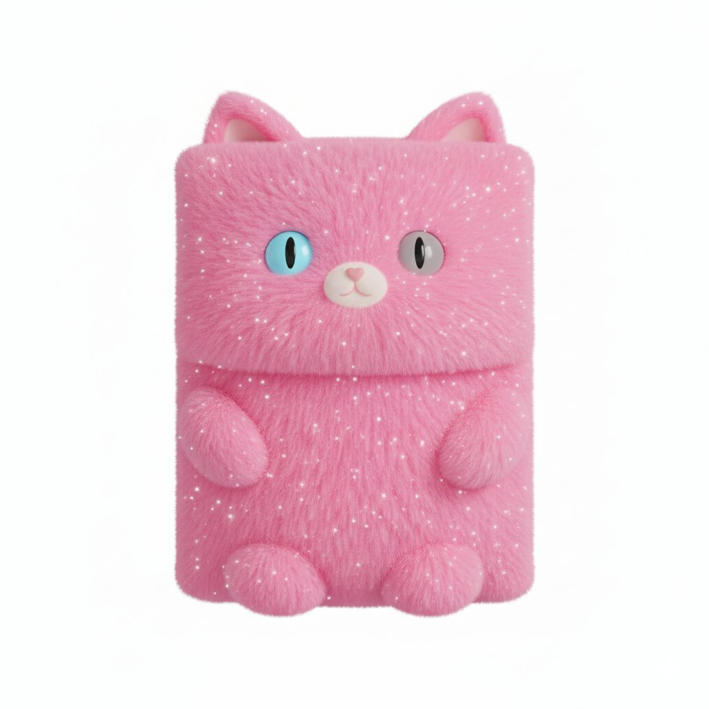
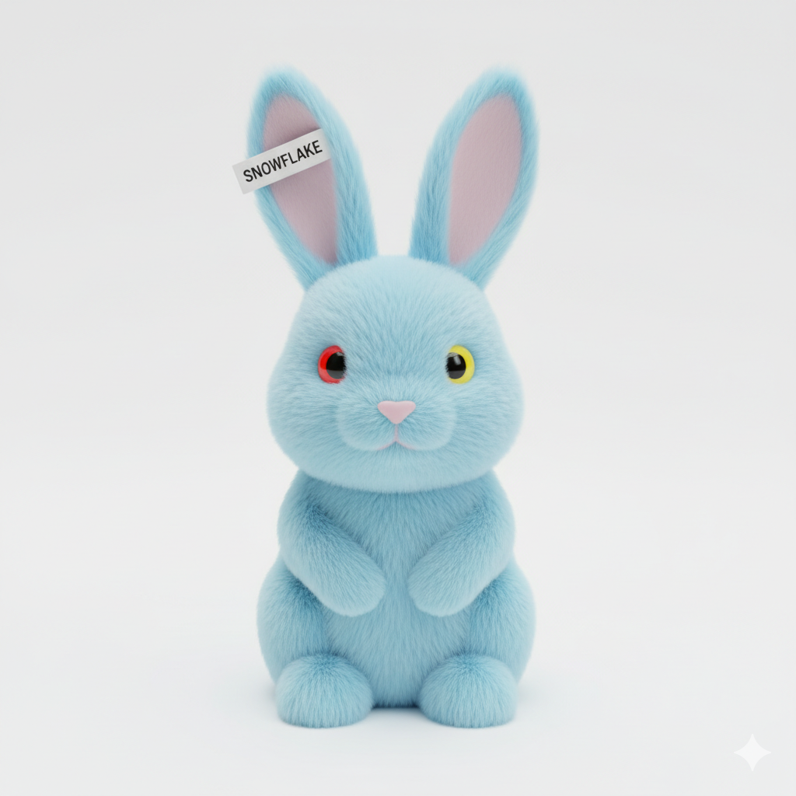

# 莱芙宁骑士团 部分研究员资料

LFN0001-00100001：

代号："盘古"

性别：男性

所属队：LFN0001队（"开天骑兵"）

所属据点：LFN0001-001据点（位于北京市朝阳区）

籍贯：北京市通州区

出生年份：2012年

加入GSCU时间：2040年

代表色：黄色、深红色

主要经历：

2040年成立LFN，并参与了GSCU的组建。

个人吉祥物：

开天大侠（2040.4 -）：穿黄色盔甲，身披深红斗篷，右手持巨锤的战神。锤头为钨制，手柄为铜制。

LFN0001-00100003：

代号："贞德"

性别：女性

所属队：LFN0001队（"开天骑兵"）

所属据点：LFN0001-001据点（位于北京市朝阳区）

籍贯：江苏省南京市江宁区

出生年份：2016年

加入GSCU时间：2040年

代表色：黄色、玫红色

主要经历：

毕业于上海美术学院，曾在毕业后不久入职南京某游戏公司，担任角色设计师。

2040年与"盘古"等LFN研究员一同参与了GSCU的组建，并且为LFN设计了吉祥物。

个人吉祥物：

虹光蝶（2040.4 -）：身体呈银白色，翅膀呈玫红色的巨型蝴蝶。

LFN1335-00100001：

代号："海燕"

性别：女性

所属队：LFN1335队（"小燕子团"）

所属据点：LFN1335-001据点（位于江苏省常州市武进区）

籍贯：江苏省常州市武进区

出生年份：2015年

加入GSCU时间：2044年

代表色：绿色、蓝色

主要经历：

2044年加入GSCU，成立了LFN第1335队（LFN1335）。

从2044年至2060年，作为LFN的知名写手之一，她撰写了十多部作品，以AI伦理为主要话题，在LFN内部甚至整个GSCU都引起了广大研究员的深刻思考，同时也促进了GT、AL等技术向俱乐部注重技术实现的伦理考量。

2055年，为了促进知识共享，她代表LFN俱乐部，与GT、AL、SLA等俱乐部一起创建了"GSCU研究员自学平台"（`https://selfstudy.gscuglobal.org`），该平台拥有大量的直播和录播课程，方便各位研究员利用空闲时间自学。

个人吉祥物：

1335型人造精灵（2044.2 -）：身穿蓝色制服，长着一对翠绿色翅膀的精灵。

LFN1677-00500013：

代号："晴"

性别：女性

所属队：LFN1677队（"喵喵众"）

所属据点：LFN1677-005据点（位于江苏省南京市江宁区）

籍贯：江苏省南京市江宁区

出生年份：2023年

加入GSCU时间：2047年

代表色：粉色、橙色

主要经历：

2045年毕业于东南大学，2047年加入GSCU。

作为LFN1677内部的研究员，她曾代表LFN1677，发起了一项重要的联盟决议：鼓励各俱乐部、队、据点搭建Minecraft服务器，为各位研究员提供发挥想象力的空间。

在该项决议通过后，她搭建了一个名为"LFN1677
Garden"的Minecraft服务器，许多LFN1677的研究员在闲暇之时都会来到这个服务器，他们通过建造，将平时不方便表达的想法在充满方块的世界中显现出来。就这样，LFN1677的文化活力显著提高。

个人吉祥物：

第一代：粉晴（2047.8 - 2055.1）：体毛粉色与橙色相间，体态圆润，粉绿异瞳的猫。

第二代：糖糕（2055.1 -）：体毛呈粉色，带有白色星点，蓝灰异瞳，外形大致呈长方体的猫。

LFN2018-00100001：

代号："冰火铁血"

性别：男性

所属队：LFN2018队（"冰火剑骑士团"）

所属据点：LFN2018-001据点（位于福建省厦门市海沧区）

籍贯：浙江省嘉兴市嘉善县

出生年份：2019年

加入GSCU时间：2045年

代表色：蓝色、橙色、钢灰色、灰褐色

主要经历：

2019年出生于一个工匠家庭。

2045年加入GSCU之初，他只是LFN1335一名普通的研究员，编号为LFN1335-01400462（LFN1335-014位于浙江省杭州市滨江区）。

在2049年4月8日，他为LFN创立了第2018队，名为"冰火剑骑士团"，编号LFN2018。

之后，他退出了LFN1335，成为LFN2018的"开队元帅"。

十多年来，他重视LFN2018内部各位研究员的意见，允许甚至鼓励LFN2018内部研究员当面指出LFN2018内部出现的问题，以及为LFN2018的发展提供建设性的、有远见的、可持续的建议，LFN2018高速发展，从2049年的300多名研究员扩展到2060年的超过100万名研究员，将LFN2018打造成LFN内部的模范，甚至有数十个LFN队伍和一些非LFN队伍"取经"。

个人吉祥物：

圣火（2045.3 -）：身穿熔岩战甲的忍者，手套周围有火焰轮廓。

LFN2018-00121376：

代号："白雪公主"

性别：女性

所属队：LFN2018队（"冰火剑骑士团"）

所属据点：LFN2018-001据点（位于福建省厦门市海沧区）

籍贯：浙江省嘉兴市桐乡市

出生年份：2029年

加入GSCU时间：2052年

代表色：蓝色、红色、白色

主要经历：

2052年加入GSCU，最初是AL的一名研究员，编号AL0032-00102613（AL0032-001位于浙江省嘉兴市桐乡市）。

在2054年，她从AL俱乐部转入LFN俱乐部。

2058年，她与AL俱乐部合作，搭建了"GSCU Wiki"（`https://wiki.gscuglobal.org`），一个类似于维基百科，收录大量亚文化内容，并且带有AI讲解功能，方便内界（GSCU研究员）和外界（非GSCU研究员）人士了解各种亚文化的Wiki网站。

个人吉祥物：

第一代：冰脑（2052.1 - 2054.2，AL时期）：正方体冰块状的精灵，外表呈半透明蓝色，棱角光滑。

第二代：雪花（2054.2 - 2058.3，LFN时期第一阶段）：浅蓝色的兔子，红黄异瞳。

第三代：雪花2.0（2058.3 -，LFN时期第二阶段------GSCU Wiki时期）：浅蓝色的兔子，红黄异瞳，戴着金色眼镜，翻着一本厚厚的词典。

LFN2018-00907184：

代号："光雨"

性别：女性

所属队：LFN2018队（"冰火剑骑士团"）

所属据点：LFN2018-009据点（位于福建省泉州市惠安县）

籍贯：山东省枣庄市台儿庄区

出生年份：2044年

加入GSCU时间：2052年

代表色：黑色、白色、黄色、深紫色

个人经历：

2052年（8岁）加入GSCU。由于她年龄较小（截止至2060年，她还只有16岁，并且还是一名高一学生。这导致她在个别行动上会受到一定限制），大多数时间都在线上行动，线下行动通常只会在周末、节假日和寒暑假进行。

最初，她是LFN2018-009（位于福建省泉州市惠安县）的一名研究员，编号为LFN2018-00900372。

在加入GSCU之初，她就已经表现出编程天赋，能用Scratch写出简单的游戏。

10岁（2054年）时又接触了C/C++和Python，到了12岁，她开始负责一些简单的运维项目，到了13岁（2057年），她又开始看《Learn You a Haskell for Great Good!》（LYAH）等Haskell书籍，短短几个月就已经掌握Haskell并能够通过Haskell参与开发。

截至2060年4月1日，她已参与过LFN的40多个软件开发项目，其中由她主导的超过10个，使用Haskell的有3个（均由她本人主导）。

2059年1月16日（15岁，戊寅年腊月初三），她返回老家山东省枣庄市台儿庄区，为LFN2018成立了一个新据点，据点编号为LFN2018-469（LFN第2018队第469据点），她的研究员编号变更为LFN2018-46900001，但在一个多月后，2059年2月23日（己卯年正月十二），由于寒假即将结束，加上她在几个月后要参加中考（2059年6月），她将自己在LFN2018-469的线下事务转交给LFN2018-46900002（出生于2031年，已成年，但具体身份未知），她自己则从山东返回福建，回归LFN2018-009。

之后，她的研究员编号再次变更――她被重新授予一个新的研究员编号LFN2018-00907184（由于她成立LFN2018-469之前已经退出LFN2018-009，在她重返LFN2018-009之后，旧编号LFN2018-00900372不会再恢复）。

中考结束后不久，2059年6月下旬，她被"白雪公主"授予GSCU Wiki管理员身份（在她之前，整个GSCU获得该身份的只有几百位，而在LFN也只有十几位，到了LFN2018则只有4位。她是LFN2018第五位GSCU Wiki管理员。），主要负责代码评审。

2060年3月，她在GSCU研究员自学平台发布了"LFN程序设计启蒙"（包含两个子系列："LFN程序设计启蒙·Scratch"、"LFN程序设计启蒙·Python"）和"LFN程序设计与软件开发课堂"（包含三个子系列："LFN程序设计与软件开发课堂·Python"、"LFN程序设计与软件开发课堂·C/C++"、"LFN程序设计与软件开发课堂·Haskell"）两个课程系列，但由于她还未成年，她的所有课程都是录播。

个人吉祥物：

2052.3 - 2054.6：无吉祥物。

第一代：光年（2054.6 - 2057.12）：戴着小黄帽，体毛呈白色，蓝黑异瞳的小鸭子。

第二代：紫月（2057.12 -）：身穿紫黑相间战甲，背着一把黄色弓臂、紫色弓弦长弓，装有一种特殊弓箭（箭头形状是希腊字母Lambda的模样）的精灵。

